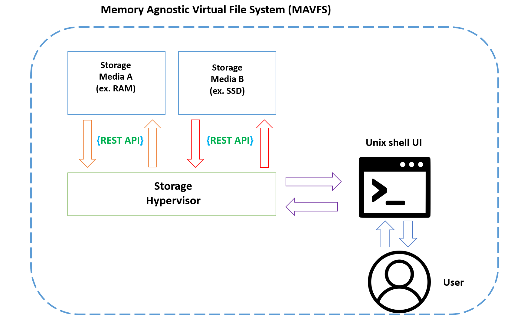

# Memory Agnostic Virtual File System (MAVFS) 

MAVFS is a virtualized file system (VFS) that uses the MAFS protocol between two or more physical or virtual storage media. 
The primary use case is combining RAM and disk based storage into an easy to use VFS, which allows faster read/write access to data stored in RAM, 
and faciltating easy transfer from "hot" storage (RAM) into "cold" storage (disk). The MAFS is a protocol which allows for the combination of two or more file systems into a single VFS, even when
one or more of the underlying constituent file systems are themselves virtual. 

Because MAVFS itself abstracts the specifics of the component file systems used, many possible file system combinations exist. Here, note that MAVFS does *not* have its own standard implementation as many file systems do. The MAFS protocol is what unifies two different file systems on physical devices (or virtualized storage) into one cohesive unit.

As such, the MAFS protocol needs to delicately balances implementation flexibility with a clearly defined standard that allows for sufficient distinction between MAVFS and other file systems. The current standard is as follows (but will likely evolve over time): 

1) **Unix-like shell/UI** - This ensures a common interface, regardless of the underlying back-end implementation for the file systems in the storage media. Unix shells are familiar to many developers, and many of the commands used in the MAFS protocol are commands similar to directly borrowed from other Unix shells.
2) **Storage Hypervisor** - This is a software abstraction layer which has three components:
   - Read/write access between the file systems on storage media A and B (in both directions).
   - RESTful APIs for file data and metadata in the file systems of the two storage media. Enforcing REST APIs is a useful standard that allows for standardized logging, debugging and more. 
   - Implements the MAFS standard set of commands which can be directly run from the UI. (i.e creating/deleting files and all common file related tasks can be done in the shell UI).
3) **MAFS command standard** - this is a list of the bare minimum set of commands to make MAVFS usable.
4) **Mount support** - this allows the entire file system to be mounted onto an external server or VM. To provide a concrete example when one file system uses RAM and another uses disk, a successfully mounted MAVFS will allow the client to access the files in both RAM *and* disk which are inside the MAVFS on the original host. (Note that the host can choose only a subset of files to be available in RAM and disk, and this would be reflected in the client).
5) **POSIX Compliance (Bonus)** - This is a nice-to-have, but not strictly required today. Many pros and cons exist for enforcing POSIX compliance in MAFS, but these will be revisited at a later time.

** Architecture

The following diagram below illustrates a MAVFS 

     
